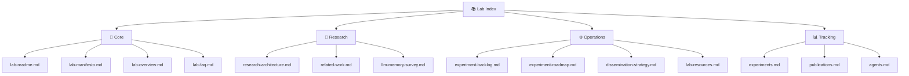

# 🔬 OPTIMI Memory Lab

> Personal research laboratory for AI Memory and Context Intelligence

---

## Navigation

---

## Quick Links

### Core
- [Lab README](core/lab-readme.md) — Entry point
- [Lab Manifesto](core/lab-manifesto.md) — Mission & principles
- [Lab Overview](core/lab-overview.md) — One-page summary
- [Lab FAQ](core/lab-faq.md) — Common questions

### Research
- [Research Architecture](research/research-architecture.md) — 8 Layers of Context
- [Related Work](research/related-work.md) — Similar projects & opportunities
- [LLM Memory Survey](research/llm-memory-survey.md) — State of the art (Jan 2026)

### Operations
- [Experiment Backlog](ops/experiment-backlog.md) — What to explore
- [Experiment Roadmap](ops/experiment-roadmap.md) — Timeline
- [Dissemination Strategy](ops/dissemination-strategy.md) — How to share
- [Lab Resources](ops/lab-resources.md) — Budget & tools

### Tracking
- [Experiments](tracking/experiments.md) — Lab notebook
- [Publications](tracking/publications.md) — Published work
- [Agents](tracking/agents.md) — AI lab assistants

---

## Success Metrics

| Metric | Target | Cadence |
|--------|--------|---------|
| Experiment reports | 2 | /quarter |
| Blog posts | 4 | /month |
| OSS tool releases | 1 | /6 months |
| arXiv papers | 1 | /year |

---

*Last updated: January 2026*
