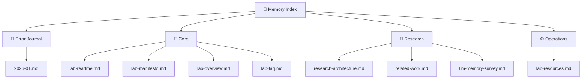

# 🧠 OPTIMI Living Memory

> Learn from your mistakes with AI agents. Remember patterns. Avoid repeating errors.

---

## Navigation

---

## Quick Links

### 📝 Error Journal (NEW)
- [How to Log](journal/index.md) — Instructions for recording errors
- [January 2026](journal/2026-01.md) — Current month entries

### Core
- [Lab README](core/lab-readme.md) — Entry point
- [Lab Manifesto](core/lab-manifesto.md) — Mission & principles
- [Lab Overview](core/lab-overview.md) — One-page summary
- [Lab FAQ](core/lab-faq.md) — Common questions

### Research
- [Research Architecture](research/research-architecture.md) — 8 Layers of Context
- [Related Work](research/related-work.md) — Similar projects & opportunities
- [LLM Memory Survey](research/llm-memory-survey.md) — State of the art (Jan 2026)

### Operations
- [Lab Resources](ops/lab-resources.md) — Budget & tools

### Archive
- [Tracking](tracking/) — Historical experiments & publications
- [Archive](archive/) — Previous documentation

---

## What is Living Memory?

A practical system for **learning from AI collaboration failures**:

1. **Log errors** when something goes wrong with Claude, Cursor, or any AI agent
2. **Find patterns** — same mistakes repeat across projects
3. **Build memory** — create rules and prompts that prevent repetition
4. **Evolve** — the system grows with your experience

---

## Success Metrics

| Metric | Target | Cadence |
|--------|--------|---------|
| Error entries | 10+ | /month |
| Patterns discovered | 3+ | /month |
| Prevention rules created | 1+ | /week |

---

*Last updated: January 2026*
